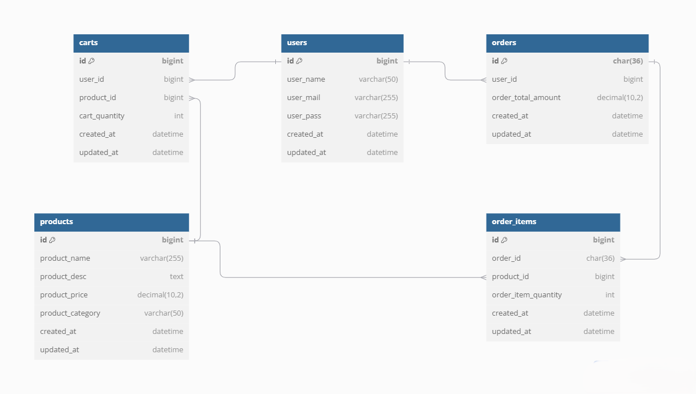

# Simple e-commerce

A simple e-commerce backend service using :

<p align="center"><a href="https://expressjs.com/" target="_blank"></a></p>  

_*nb:_ **_The structure and clean architecture in this project aren't perfect yet, but this is merely an approach to implementing Uncle Bob's clean architecture concept.  It will be updated if there are any changes in the future._**

## Requirements

this e-commerce is currently extended with the following requirements.  
Instructions on how to use them in your own application are linked below.

| Requirement | Version |
| ----------- | ------- |
| Node JS     | 20.10.0 |
| Express JS  | 4.16.1  |
| MySQL       | 8.0.30  |

## Entity Relationship Diagram



## Installation

Make sure the requirements above already install on your system.  
Clone the project to your directory and install the dependencies.

```bash
$ git clone https://github.com/wisnuakbara/simple-ecommerce
```

```bash
$ cd simple-ecommerce
```

```bash
$ npm install
```

## Configuration

Copy the .env.example and rename it to .env.

```bash
$ cp .env.example .env
```

Change the config for your local server.

```bash
DB_HOST="localhost"
DB_PORT=3306
DB_USER="root"
DB_PASSWORD=""
DB_DATABASE="ecommerce_db_v1"
DB_DIALECT="mysql"

JWT_SECRET="this-is-secret"
JWT_EXPIRATION="1h"
```

## Migration

Run the migration.

```bash
$ npm run db:migrate
```

Run the seeder.

```bash
$ npm run db:seed
```

## Running Local Development Server

_this will run server with nodemon enabled_

```bash
$ npm run dev
```
